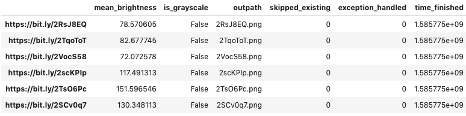
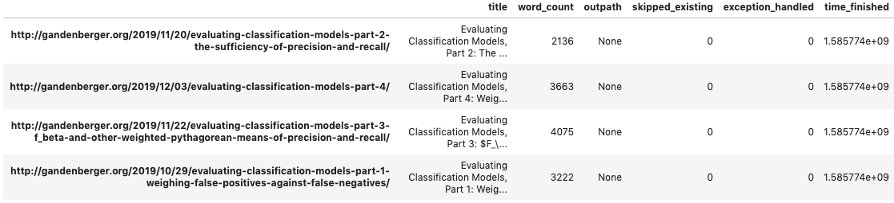

Quickstart
==========

Basic Pipelines
---------------

Example: Downloading and Processing Images
^^^^^^^^^^^^^^^^^^^^^^^^^^^^^^^^^^^^^^^^^^

The following code takes a list of image URLs and for each one downloads the file contents, trims off its bottom 100 pixels, resizes it to 224x224, and writes the result to disk, using ten threads for concurrency. Because the pipline is called with ``exceptions_to_catch=AttributeError``\ , this code will catch ``AttributeError``\ s that arise during file processing, logging them as errors but continuing execution. (This error-handling functionality is useful for dealing with occasional corrupted input files.)

.. code-block:: python

   from functools import partial

   from creevey import Pipeline
   from creevey.load_funcs.image import load_image_from_url
   from creevey.ops.image import resize
   from creevey.write_funcs.image import write_image
   from creevey.path_funcs import join_outdir_filename_extension

   trim_bottom_100 = lambda image: image[:-100, :]
   resize_224 = partial(resize, shape=(224, 224))

   trim_resize_pipeline = Pipeline(
       load_func=load_image_from_url, ops=[trim_bottom_100, resize_224], write_func=write_image
   )

   image_filenames = ['2RsJ8EQ', '2TqoToT', '2VocS58', '2scKPIp', '2TsO6Pc', '2SCv0q7']
   image_urls = [f'https://bit.ly/{filename}' for filename in image_filenames]

   keep_filename_png_in_cwd = partial(
       join_outdir_filename_extension, outdir='.', extension='.png'
   )
   run_report = trim_resize_pipeline(
       inpaths=image_urls,
       path_func=keep_filename_png_in_cwd,
       n_jobs=10,
       skip_existing=True,
       exceptions_to_catch=AttributeError,
   )

Notice that we call a ``Pipeline`` object directly in order to run it (e.g. ``trim_resize_pipeline(inpaths=image_urls, ...)``), rather than calling a named method.

When a ``Pipeline`` object is called, it returns a "run report:" a Pandas DataFrame with each input path as its index and columns indicating the corresponding output path ("outpath"), whether processing was skipped because a file already existed at the output path ("skipped_existing"), whether processing failed due to an exception in ``exceptions_to_catch`` ("exception_handled"), and a timestamp indicating when processing completed ("time_finished"):

If you pass ``exceptions_to_catch=Exception`` to a pipeline call, Creevey will simply catch all exceptions (aside from things a few like `KeyboardInterrupt` that don't arise from the code).

.. image:: ./images/run_report_image.png
   :target: ./images/run_report_image.png
   :alt: 

If ``n_jobs`` is greater than 1, then the order of the input files in the run report typically will not match the order in ``inpaths``\ ; a command like ``run_report.loc[inpaths, :]`` can be used to restore the original ordering if desired. 

The ``Pipeline`` Class
^^^^^^^^^^^^^^^^^^^^^^^^^^

Creevey's core abstraction is the ``Pipeline`` class.

Creating a ``Pipeline``
~~~~~~~~~~~~~~~~~~~~~~~~~~~

 A ``Pipeline`` constructor takes three arguments:

#. A function ``load_func`` that takes a string or Path object and returns some kind of data structure in memory. In this example, ``download_image`` takes an image URL and returns the contents of the corresponding image as a NumPy array.
#. A list ``ops`` of single-argument functions that can be piped together, with the first taking the return value of ``load_func`` as its input. Using a common data structure type for a single type of data is recommended so that it is easy to recombine ``ops`` functions; for instance, Creevey uses NumPy arrays for image data.
#. A function ``write_image`` that takes the output of the last function in ``ops`` and writes it out to a specified location. In this example, ``write_image`` takes a NumPy array image and writes it to disk.

Running a ``Pipeline``
~~~~~~~~~~~~~~~~~~~~~~~~~~

A ``Pipeline`` object takes the following arguments when called:

#. An iterable ``inpaths`` of input paths (a list of image URLs in this example).
#. A function ``outpath_func`` for transforming each path in ``inpaths`` into a corresponding output path. In this example, ``keep_filename_png_in_cwd`` uses the filename from the URL but gives it a PNG extension and places it in the current working directory.
#. The number ``n_jobs`` of threads to run (10 in this example).
#. A Boolean ``skip_existing`` indicating whether to overwrite existing files or to skip processing input files that would result in overwriting existing files.
#. An exception type or tuple of exceptions types ``exceptions_to_catch`` (optional) to catch and log without raising.

Extending an Existing Pipeline
~~~~~~~~~~~~~~~~~~~~~~~~~~~~~~

We can simplify our sample code snippet by using an existing pipeline for downloading and writing images and simply adding our ``ops``.

.. code-block:: python

   from creevey.pipelines.image import download_image_pipeline

   trim_resize_pipeline = download_image_pipeline
   trim_resize_pipeline.ops = [trim_bottom_100, resize_224]

More generally, it is easy to modify an existing ``Pipeline`` object simply by modifying the relevant attributes.

Adding Custom Reporting
-----------------------

Example: Recording Image Properties
^^^^^^^^^^^^^^^^^^^^^^^^^^^^^^^^^^^

When a ``Pipeline`` object is called, returns a "run report" with basic information about what happened during the run. The ``CustomReportingPipeline`` allows you to add additional information to these reports by adding to them within your ``load_func``\ , ``ops``\ , and ``write_func``. For instance, when processing a set of image files you might wish to record each image's mean brightness while you already have it open so that you can later experiment with removing washed-out images from your dataset. Here is an example of a ``CustomReportingPipeline`` that uses a built-in ``report_mean_brightness`` function to record the brightness of each image and a custom ``report_is_grayscale`` function to record whether or not it is grayscale. The pipeline runs those functions on each image during the download process and returns their outputs in the final run report. 

.. code-block:: python

   from functools import partial

   from creevey import CustomReportingPipeline
   from creevey.load_funcs.image import load_image_from_url
   from creevey.ops import get_report_output_decorator
   from creevey.ops.image import report_mean_brightness
   from creevey.path_funcs import join_outdir_filename_extension
   from creevey.write_funcs.image import write_image

   @get_report_output_decorator(key='is_grayscale')
   def report_is_grayscale(image):
       return image.ndim == 2

   # report_mean_brightness is part of Creevey, report_is_grayscale is custom
   pipeline = CustomReportingPipeline(
       load_func=load_image_from_url, ops=[report_mean_brightness, report_is_grayscale], write_func=write_image
   )

   image_filenames = ['2RsJ8EQ', '2TqoToT', '2VocS58', '2scKPIp', '2TsO6Pc', '2SCv0q7']
   image_urls = [f'https://bit.ly/{filename}' for filename in image_filenames]

   keep_filename_png_in_cwd = partial(
       join_outdir_filename_extension, outdir='.', extension='.png'
   )
   run_report = pipeline(
       inpaths=image_urls,
       path_func=keep_filename_png_in_cwd,
       n_jobs=1,
       skip_existing=False,
   )

Here is the resulting run report:

The ``CustomReporting`` Class
^^^^^^^^^^^^^^^^^^^^^^^^^^^^^^^^^

You define and run a ``CustomReportingPipeline`` object in the same way that you define and run a basic ``Pipeline`` object, except that the elements of ``ops`` and ``write_func`` need to accept the input path as an additional keyword argument "inpath"; and ``write_func``\ , ``ops`` and ``write_func`` need to accept a ``defaultdict(dict)`` object as another keyword argument "log_dict", which stores the run report information for a single file. You can then enrich your run reports in one of these functions by writing e.g. ``log_dict[inpath]['mean_brightness'] = mean_brightness`` inside one of the functions in the pipeline (assuming that you have calculated ``mean_brightness``\ ).

The ``get_report_output_decorator`` function can be used as in the example above to modify a function that takes a single input and returns a single output for use in a ``CustomReportingPipeline``. It wraps the function it decorates to return  that function's input and add its output to ``log_dict[inpath]`` with the specified key. 

Files that would be written to an output location where there is an existing file are skipped entirely when ``skip_existing=True``\ , so custom reports will not be written for those files.

Non-Image Example: Text Scraping
--------------------------------

Creevey is not limited to images! It applies anywhere you want to process data from many sources. For instance, we can use it to scrape online text. The example below uses it to get titles and crude word counts for four blog posts.

.. code-block:: python

   import re
   import urllib.request

   from creevey import CustomReportingPipeline
   from creevey.ops import get_report_output_decorator

   URLS = [
       "http://gandenberger.org/2019/10/29/evaluating-classification-models-part-1-weighing-false-positives-against-false-negatives/",
       "http://gandenberger.org/2019/11/20/evaluating-classification-models-part-2-the-sufficiency-of-precision-and-recall/",
       "http://gandenberger.org/2019/11/22/evaluating-classification-models-part-3-f_beta-and-other-weighted-pythagorean-means-of-precision-and-recall/",
       "http://gandenberger.org/2019/12/03/evaluating-classification-models-part-4/",
   ]

   def read_from_url(url, *args, **kwargs):
       return str(urllib.request.urlopen(url).read())

   @get_report_output_decorator(key="title")
   def record_title(html):
       return re.search(r'<meta property="og:title" content="(.*?)" />', html).group(1)

   @get_report_output_decorator(key="word_count")
   def count_words(html):
       return len(html.split())

   def do_nothing(*args, **kwargs):
       pass

   pipeline = CustomReportingPipeline(
       load_func=read_from_url, ops=[record_title, count_words], write_func=do_nothing,
   )

   pipeline(inpaths=URLS, path_func=do_nothing, n_jobs=4, skip_existing=False)

Here is the resulting run report:

