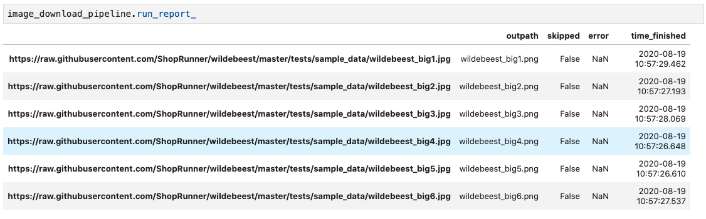
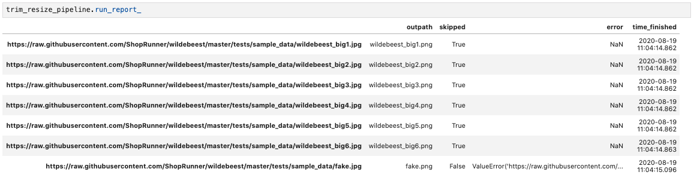
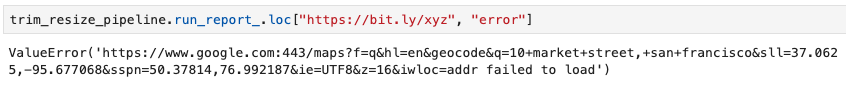
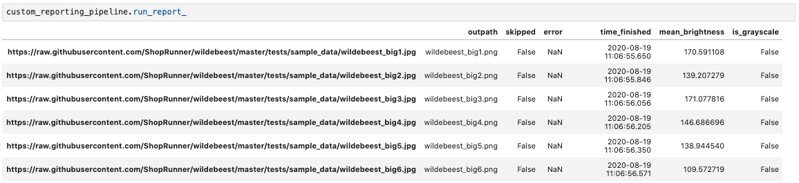
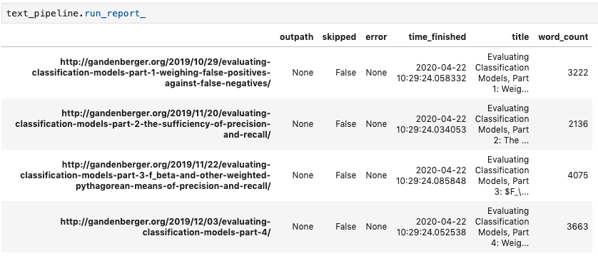

Quickstart
==========

Basic Image Download Example
----------------------------

The following code uses a fairly minimal Creevey pipeline to download a list of images to the current working directory as PNGs, parallelizing across up to ten threads.

.. code-block:: python

    from functools import partial

    from creevey import Pipeline
    from creevey.load_funcs.image import load_image_from_url
    from creevey.path_funcs import join_outdir_filename_extension
    from creevey.write_funcs.image import write_image

    image_urls = [
        f"https://bit.ly/{filename}" for filename in ["2RsJ8EQ", "2TqoToT", "2VocS58"]
    ]

    # Create a pipeline object, specifying how to load a file and how to
    # write out each file
    image_download_pipeline = Pipeline(
        load_func=load_image_from_url, write_func=write_image
    )

    # Run the pipeline, specifying input paths, how to derive an output path
    # from each input path, and how many threads to use
    image_download_pipeline(
        inpaths=image_urls,
        path_func=partial(join_outdir_filename_extension, outdir=".", extension=".png"),
        n_jobs=10,
    )

Notice that we call a ``Pipeline`` object directly in order to run it (e.g. ``image_download_pipeline(...)``), rather than calling a named method.

After it runs, ``image_download_pipeline(...)`` has a Pandas DataFrame containing a record of what happened with each input file stored as an attribute called ``run_report_``:

The trailing underscore in ``run_report_`` indicates that the attribute exists only after the pipeline has been run, analogous to the scikit-learn convention of using a trailing underscore for ``Estimator`` attributes that exist only after the attribute has been fit (e.g. ``LinearRegression().coef_``).

If ``n_jobs`` is greater than 1, then the order of the input files in the run report typically will not match the order in ``inpaths``\ ; a command like ``run_report.loc[inpaths, :]`` can be used to restore the original order if desired.

Because downloading images is a common use case for Creevey, we have provided a ``download_image_pipeline`` pipeline that you can simply import, resulting in the following simplified version of the code above:

.. code-block:: python

    from functools import partial

    from creevey.path_funcs import join_outdir_filename_extension
    from creevey.pipelines.image import download_image_pipeline

    image_urls = [
        f"https://bit.ly/{filename}" for filename in ["2RsJ8EQ", "2TqoToT", "2VocS58"]
    ]

    download_image_pipeline(
        inpaths=image_urls,
        path_func=partial(join_outdir_filename_extension, outdir=".", extension=".png"),
        n_jobs=10,
    )

Extended Image Download Example
-------------------------------

The following example processes a few more files with three additional wrinkles:

- It checks whether a file already exists at the prospective output location and skips the corresponding input file if it does, through the ``skip_func`` pipeline run parameter.
- For each file that it doesn't skip, it trims off the bottom 100 pixels of each and resizes the result to 224x224, through the ``ops`` ``Pipeline`` parameter.
- It handles ``ValueError`` exceptions that arise during file processing by logging them and recording them in the run report but not halting execution for them, while allowing other exceptions to be raised, through the ``exceptions_to_catch`` pipeline run parameter. You can also pass ``None`` or a tuple of exception types to ``exceptions_to_catch`` (e.g. ``(ValueError, AttributeError)``). The default value for ``exceptions_to_catch`` is ``Exception``, so that ALL exceptions that arise during file processing are caught and recorded without halting execution, aside from a few exceptions such as ``KeyboardInterrupt`` that do not arise from the code.

.. code-block:: python

    from pathlib import Path
    from functools import partial

    from creevey import Pipeline
    from creevey.load_funcs.image import load_image_from_url
    from creevey.ops.image import resize
    from creevey.write_funcs.image import write_image
    from creevey.path_funcs import join_outdir_filename_extension

    image_urls += [
        f"https://bit.ly/{filename}"
        for filename in ["2scKPIp", "2TsO6Pc", "2SCv0q7", "xyz"]
    ]

    trim_resize_pipeline = Pipeline(
        load_func=load_image_from_url,
        # provide image-processing functions
        ops=[lambda image: image[:-100, :], partial(resize, shape=(224, 224))],
        write_func=write_image,
    )

    trim_resize_pipeline(
        inpaths=image_urls,
        path_func=partial(join_outdir_filename_extension, outdir=".", extension=".png"),
        n_jobs=10,
        # skip files that have already been downloaded
        skip_func=lambda inpath, outpath: Path(outpath).is_file(),
        # log and record ``ValueError``s but do not halt execution for them.
        # Default behavior is to catch all errors that inherit from ``Exception``!
        exceptions_to_catch=ValueError,
    )

Here is the resulting run report:

We can see that the first three files were skipped because they had already been downloaded; note that as a result, they have NOT been trimmed and resized. If we had not provided a ``skip_func``, then the existing local copies would have been overwritten with trimmed and resized versions.

In addition, the last file had a bad URL, resulting in a ``ValueError``. The value in the table for the "error" column in that row is the resulting ``ValueError`` exception itself:

We could simplify the code above by using the provided ``download_image_pipeline`` and simply adding our ``ops``.

.. code-block:: python

   from creevey.pipelines.image import download_image_pipeline

   trim_resize_pipeline = download_image_pipeline
   trim_resize_pipeline.ops = [
       lambda image: image[:-100, :],
       partial(resize, shape=(224, 224)),
   ]

More generally, you can modify attributes of an existing ``Pipeline`` object.

Another Use for ``skip_func``
-----------------------------

``skip_func=lambda inpath, outpath: Path(outpath).is_file()`` often makes sense when you are writing files locally and don't want to repeat work. However, suppose you are using Creevey to copy files from one S3 bucket to another. You could write a function to check whether a file exists at the output URL (e.g. ``requests.head(outpath).status_code < 400``), but in my testing running that function was slower than copying the file. An alternative approach is to make a set of all of the files in the output bucket before running the pipeline and pass ``skip_func`` a function that checks whether ``outpath`` is in that set.

More generally, (1) ``skip_func`` is not limited to checking whether the output file already exists locally, and (2) generating a set of paths to skip up front and checking against that set with ``skip_func`` may be faster than performing some operation on each path on the fly to decide whether to skip it.

Skipping Files Based on Content
-------------------------------

``skip_func`` is useful for deciding whether to skip a file based on information that you can obtain without opening the files, because it allows you to avoid ever opening the files that you skip. It is not recommended for cases where you need to open the file in order to decide whether to skip it (such as skipping images that are too bright, where that information is not in the image metadata) because you would then be opening the files that you do not skip twice, which will generally slow down processing substantially. I would recommend instead creating a custom exception type (e.g. ``WashedOutImageError``), having the first function in ``ops`` raise that exception when appropriate, and including that exception type in ``exceptions_to_catch`` (which will happen by default as long as your exception inherits from ``Exception``). That way your pipeline will not do any further processing on those files, and it will be easy to see in the run report which files were skipped in this way.

Custom Reporting Example
------------------------

The ``CustomReportingPipeline`` class allows you to add additional information to your run reports reports by adding to them within your ``load_func``, ``ops``, and ``write_func``. For instance, when processing a set of image files you might wish to record each image's mean brightness while you already have it open so that you can later experiment with removing washed-out images from your dataset. Here is an example of a ``CustomReportingPipeline`` that uses a built-in ``report_mean_brightness`` function to record the brightness of each image and a custom ``report_is_grayscale`` function to record whether or not it is grayscale. The pipeline runs those functions on each image during the download process and returns their outputs in the final run report. 

.. code-block:: python

    from functools import partial

    from creevey import CustomReportingPipeline
    from creevey.load_funcs.image import load_image_from_url
    from creevey.ops import get_report_output_decorator
    from creevey.ops.image import report_mean_brightness
    from creevey.path_funcs import join_outdir_filename_extension
    from creevey.write_funcs.image import write_image

    @get_report_output_decorator(key="is_grayscale")
    def report_is_grayscale(image):
        return image.ndim == 2

    custom_reporting_pipeline = CustomReportingPipeline(
        load_func=load_image_from_url,
        ops=[report_mean_brightness, report_is_grayscale],
        write_func=write_image,
    )

    custom_reporting_pipeline(
        inpaths=image_urls,
        path_func=partial(join_outdir_filename_extension, outdir=".", extension=".png"),
        n_jobs=1,
    )

Here is the resulting run report:

Note that if we use ``skip_func`` to skip files in a ``CustomReportingPipeline``, then custom information about those files will not be included in the run report.

Text Scraping Example
---------------------

Creevey is not limited to images! It applies anywhere you want to process data from many sources. For instance, we can use it to scrape online text. The example below uses it to get titles and crude word counts for four blog posts.

.. code-block:: python

    import re
    import urllib.request

    from creevey import CustomReportingPipeline
    from creevey.ops import get_report_output_decorator

    URLS = [
        "http://gandenberger.org/2019/10/29/evaluating-classification-models-part-1-weighing-false-positives-against-false-negatives/",
        "http://gandenberger.org/2019/11/20/evaluating-classification-models-part-2-the-sufficiency-of-precision-and-recall/",
        "http://gandenberger.org/2019/11/22/evaluating-classification-models-part-3-f_beta-and-other-weighted-pythagorean-means-of-precision-and-recall/",
        "http://gandenberger.org/2019/12/03/evaluating-classification-models-part-4/",
    ]

    def read_from_url(url, *args, **kwargs):
        return str(urllib.request.urlopen(url).read())

    @get_report_output_decorator(key="title")
    def record_title(html):
        return re.search(r'<meta property="og:title" content="(.*?)" />', html).group(1)

    @get_report_output_decorator(key="word_count")
    def count_words(html):
        return len(html.split())

    def do_nothing(*args, **kwargs):
        pass

    text_pipeline = CustomReportingPipeline(
        load_func=read_from_url, ops=[record_title, count_words], write_func=do_nothing,
    )

    text_pipeline(inpaths=URLS, path_func=do_nothing, n_jobs=4)

Here is the resulting run report:

Notice that in this case we just want the information in the run report and don't want to write out processed versions of the input files, so we pass a dummy function ``do_nothing`` to ``write_func`` and ``path_func``.
